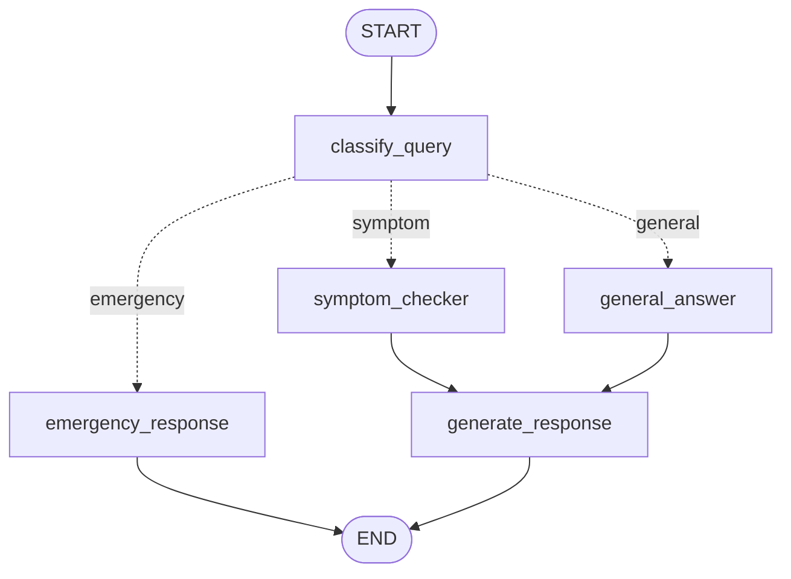

# 🩺 MedAssist

An agentic AI patient Q&A assistant built with **LangGraph** multi-agent orchestration, **FastMCP** structured tools, and a **Streamlit** chat frontend. MedAssist triages every message, routes it through the right specialist path, grounds answers with live web search, and persists every conversation to SQLite.

> ⚠️ **Disclaimer:** MedAssist provides health *information* only. It is not a medical device, does not diagnose or prescribe, and is no substitute for professional medical advice. In an emergency, call your local emergency number.

## ✨ Features

- **LLM triage** — every message is classified as `symptom`, `general`, or `emergency` using structured output (Pydantic) on Groq's Llama 3.3 70B
- **Emergency short-circuit** — red-flag messages skip everything and immediately return an urgent-care warning
- **Symptom analysis** — extracted symptoms are checked against a red-flag table and the patient's BMI via MCP tools before the LLM drafts a cautious assessment
- **Web-grounded general answers** — general health questions trigger a DuckDuckGo search; answers cite their source URLs
- **Patient profiles** — age, sex, weight, height, allergies, and conditions are attached to every conversation
- **Persistent conversations** — a SQLite checkpointer saves every thread; the UI lists past chats in the sidebar and resumes the latest one on startup
- **Full observability** — LangSmith tracing covers every node, LLM call, and MCP tool call, grouped into conversations by thread

## 🏗️ Architecture



| Node | Role |
|---|---|
| `classify_query` | LLM triage with structured output → sets `query_type`, extracts `symptoms` + `symptom_duration` |
| `emergency_response` | Hardcoded urgent-care message, no LLM — fast and fail-safe |
| `symptom_checker` | Calls `check_symptom_red_flags` + `calculate_bmi` MCP tools, then drafts a cautious assessment |
| `general_answer` | Calls the `web_search` MCP tool (DuckDuckGo), answers with cited sources |
| `generate_response` | Appends the final response to the conversation history |

### MCP tools (`mcp_server.py`)

The FastMCP server `MedAssist-Tools` exposes five tools, called in-process by the graph and also runnable as a standalone MCP server:

| Tool | Purpose |
|---|---|
| `calculate_bmi` | BMI + WHO category from weight/height |
| `check_symptom_red_flags` | Matches symptoms against an emergency red-flag table |
| `medication_info` | Local OTC formulary lookup (generic + brand names) |
| `check_allergy_conflict` | Flags medication ↔ allergy conflicts, incl. cross-reactions |
| `web_search` | Live DuckDuckGo search (title, URL, snippet) |

## 🛠️ Tech stack

| Layer | Technology |
|---|---|
| Orchestration | LangGraph (`StateGraph`, conditional edges, SQLite checkpointer) |
| LLM | Groq — Llama 3.3 70B via `langchain-groq` |
| Tools | FastMCP server + in-process MCP client |
| Web search | DuckDuckGo (`ddgs`) |
| Frontend | Streamlit chat UI |
| Persistence | SQLite (`langgraph-checkpoint-sqlite`) |
| Observability | LangSmith tracing |

## 🚀 Getting started

### Prerequisites

- Python ≥ 3.13
- [uv](https://docs.astral.sh/uv/) package manager
- A [Groq API key](https://console.groq.com/) (free tier available)
- Optional: a [LangSmith API key](https://smith.langchain.com/) for tracing

### Setup

```bash
git clone <your-repo-url>
cd ProjectMedAssist
uv sync
```

Create a `.env` file in the project root:

```env
GROQ_API_KEY="your-groq-key"

# Optional — LangSmith tracing
LANGCHAIN_API_KEY="your-langsmith-key"
LANGSMITH_TRACING="true"
LANGSMITH_PROJECT="MedAssist"
```

### Run the app

```bash
uv run streamlit run frontend.py
```

> Always launch through `uv run` so the project's virtual environment is used.

### Run the MCP server standalone (optional)

The graph calls the tools in-process, so this is only needed to expose the tools to external MCP clients (e.g. Claude Desktop):

```bash
uv run python mcp_server.py                                        # stdio
uv run fastmcp run mcp_server.py:mcp --transport http --port 8001  # HTTP
```

## 📁 Project structure

```
ProjectMedAssist/
├── BackEnd.py                  # State, nodes, graph wiring, checkpointer, thread helpers
├── mcp_server.py               # FastMCP server with the five medical tools
├── frontend.py                 # Streamlit chat UI (profile sidebar, thread history)
├── pyproject.toml              # Dependencies (managed by uv)
├── .env                        # API keys (never committed)
└── medassist_checkpoints.db    # Conversation history (never committed)
```

## 💬 Usage

1. Fill in the **patient profile** in the sidebar (all fields optional)
2. Ask a question — try:
   - *"I've had a mild headache since this morning"* → symptom path with tool results
   - *"What is the difference between paracetamol and ibuprofen?"* → web-grounded answer with citations
   - *"I have crushing chest pain"* → emergency banner
3. Expand **🔧 MCP tool results** under an answer to see the raw tool outputs
4. Click **➕ New chat** for a fresh conversation (resets the profile), or reopen any previous chat from the sidebar — history persists across restarts

## 📄 License

MIT
