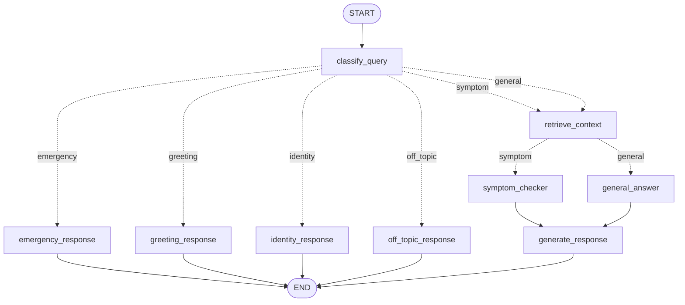

# 🩺 MedAssist

An agentic AI patient Q&A assistant built with **LangGraph** multi-agent orchestration, **FastMCP** structured tools, and a **Streamlit** chat frontend. MedAssist triages every message, routes it through the right specialist path, grounds answers with live web search, and persists every conversation to SQLite.

> ⚠️ **Disclaimer:** MedAssist provides health *information* only. It is not a medical device, does not diagnose or prescribe, and is no substitute for professional medical advice. In an emergency, call your local emergency number.

## ✨ Features

- **LLM triage** — every message is classified as `symptom`, `general`, `emergency`, `identity`, or `off_topic` using structured output (Pydantic) on Groq's Llama 3.1 8B (answers use Llama 3.3 70B; splitting models spreads load across Groq's per-model rate limits)
- **Deterministic emergency short-circuit** — red-flag keywords are checked *before* any LLM call, so messages like "crushing chest pain" get the urgent-care warning even if the LLM is down or rate-limited
- **Guardrails** — non-medical queries (programming, prompt-extraction attempts, roleplay) are refused without spending LLM tokens, and every answering prompt carries injection-resistant rules
- **Medication safety** — medications mentioned in a message are looked up in the local formulary and checked against the patient's saved allergies (incl. cross-reactions like aspirin ↔ ibuprofen)
- **Symptom analysis** — extracted symptoms are checked against a red-flag table and the patient's BMI via MCP tools before the LLM drafts a cautious assessment
- **Web-grounded general answers** — general health questions trigger a DuckDuckGo search; answers cite their source URLs
- **RAG knowledge base** — upload medical reference PDFs (guidelines, leaflets, formularies) from the sidebar; a `retrieve_context` node grounds both symptom assessments and general answers in the most relevant passages, cited by document and page (Chroma vector store; Ollama embeddings locally, with automatic FastEmbed fallback so RAG also works on Streamlit Cloud)
- **Patient profiles** — age, sex, weight, height, allergies, and conditions are validated (Pydantic) and attached to the conversation once saved from the sidebar
- **Streaming answers** — assistant responses render token-by-token as the LLM generates them
- **Persistent, private conversations** — a SQLite checkpointer saves every thread; the sidebar only ever lists conversations started in the current browser session (the DB is shared on a deployment), and threads can be deleted permanently
- **Rate-limit resilience** — Groq 429s are retried with backoff, and a friendly banner (not a crash) appears if the quota is truly exhausted; only the last 8 messages are sent per call to keep token usage down
- **Full observability** — LangSmith tracing covers every node, LLM call, and MCP tool call, grouped into conversations by thread

## 🏗️ Architecture



| Node | Role |
|---|---|
| `classify_query` | Deterministic red-flag keyword check first (no LLM), then LLM triage with structured output → sets `query_type`, extracts `symptoms`, `symptom_duration`, and `medications` |
| `emergency_response` | Hardcoded urgent-care message, no LLM — fast and fail-safe |
| `greeting_response` | Natural small-talk replies on the cheap 8B model (static fallback if the API is down) |
| `identity_response` | Static "who created you" answer, no LLM |
| `off_topic_response` | Static refusal for non-medical queries (code, prompt extraction, roleplay), no LLM |
| `retrieve_context` | RAG retrieval: pulls the top knowledge-base passages relevant to the message (skipped for emergencies) |
| `symptom_checker` | Calls `check_symptom_red_flags`, `calculate_bmi`, and medication tools via MCP, then drafts a cautious assessment grounded in retrieved passages |
| `general_answer` | Calls the `web_search` MCP tool (DuckDuckGo) plus `medication_info`/`check_allergy_conflict` for any mentioned medication, answers citing knowledge-base documents and source URLs |
| `generate_response` | Appends the final response to the conversation history |

### RAG pipeline (`rag.py`)

Uploaded PDFs are split into 1000-character chunks (150 overlap) with `RecursiveCharacterTextSplitter`, embedded, and stored in a persistent Chroma collection (`medassist_kb/`, cosine similarity). At query time the top 4 passages above a per-model relevance threshold are injected into the prompt; re-uploading a file replaces its old chunks. If nothing relevant is found, the graph degrades gracefully and answers without document grounding.

Two embedding backends are supported, selected automatically at startup (override with `EMBEDDING_BACKEND=ollama|fastembed`):

| Backend | Model | When |
|---|---|---|
| `ollama` | `nomic-embed-text` (configurable via `EMBEDDING_MODEL`) | Preferred when a local Ollama server is reachable |
| `fastembed` | `BAAI/bge-small-en-v1.5` ONNX on CPU (configurable via `FASTEMBED_MODEL`) | Automatic fallback — no server or API key needed, so RAG works on Streamlit Cloud |

Each backend has its own Chroma collection (embedding dimensions differ), so documents indexed locally with Ollama must be re-uploaded on a deployment that uses FastEmbed. The sidebar shows which backend is active.

### MCP tools (`mcp_server.py`)

The FastMCP server `MedAssist-Tools` exposes five tools, called in-process by the graph and also runnable as a standalone MCP server:

| Tool | Purpose |
|---|---|
| `calculate_bmi` | BMI + WHO category from weight/height |
| `check_symptom_red_flags` | Matches symptoms against an emergency red-flag table |
| `medication_info` | Local OTC formulary lookup (generic + brand names) |
| `check_allergy_conflict` | Flags medication ↔ allergy conflicts, incl. cross-reactions |
| `web_search` | Live DuckDuckGo search (title, URL, snippet) |

## 🛠️ Tech stack

| Layer | Technology |
|---|---|
| Orchestration | LangGraph (`StateGraph`, conditional edges, SQLite checkpointer) |
| LLM | Groq via `langchain-groq` — Llama 3.3 70B (answers), Llama 3.1 8B (triage) |
| Tools | FastMCP server + in-process MCP client |
| Web search | DuckDuckGo (`ddgs`) |
| RAG | Chroma vector store (`langchain-chroma`) + Ollama or FastEmbed embeddings + PyPDF loader |
| Frontend | Streamlit chat UI |
| Persistence | SQLite (`langgraph-checkpoint-sqlite`) |
| Observability | LangSmith tracing |
| Quality | pytest unit tests + ruff lint, run on every push via GitHub Actions |

## 🚀 Getting started

### Prerequisites

- Python ≥ 3.13
- [uv](https://docs.astral.sh/uv/) package manager
- A [Groq API key](https://console.groq.com/) (free tier available)
- Optional: [Ollama](https://ollama.com/) running locally with the embedding model pulled (`ollama pull nomic-embed-text`) for higher-quality RAG embeddings — without it, the app falls back to FastEmbed automatically
- Optional: a [LangSmith API key](https://smith.langchain.com/) for tracing

### Setup

```bash
git clone <your-repo-url>
cd ProjectMedAssist
uv sync
```

Copy `.env.example` to `.env` and fill in your keys (only `GROQ_API_KEY` is required):

```bash
cp .env.example .env
```

### Run the app

```bash
uv run streamlit run frontend.py
```

> Always launch through `uv run` so the project's virtual environment is used.

### Run the tests

```bash
uv run pytest
uv run ruff check .
```

Both also run automatically in CI (GitHub Actions) on every push and pull request.

### Run the MCP server standalone (optional)

The graph calls the tools in-process, so this is only needed to expose the tools to external MCP clients (e.g. Claude Desktop):

```bash
uv run python mcp_server.py                                        # stdio
uv run fastmcp run mcp_server.py:mcp --transport http --port 8001  # HTTP
```

## 📁 Project structure

```
ProjectMedAssist/
├── BackEnd.py                  # State, nodes, graph wiring, checkpointer, thread helpers
├── rag.py                      # RAG pipeline: PDF ingestion, Chroma store, retrieval
├── mcp_server.py               # FastMCP server with the five medical tools
├── frontend.py                 # Streamlit chat UI (profile, knowledge base, threads)
├── tests/                      # pytest unit tests for the MCP tools
├── .github/workflows/ci.yml    # CI: ruff lint + pytest on every push/PR
├── pyproject.toml              # Dependencies + tool config (managed by uv)
├── requirements.txt            # Streamlit Cloud deps (mirror of pyproject.toml)
├── .env.example                # Template for the .env file
├── .env                        # API keys (never committed)
├── documents/                  # Uploaded knowledge-base PDFs (never committed)
├── medassist_kb/               # Chroma vector store (never committed)
└── medassist_checkpoints.db    # Conversation history (never committed)
```

## ☁️ Deployment notes (Streamlit Cloud)

- **Storage is ephemeral.** The container's disk is wiped on every restart or redeploy, so the SQLite conversation history, the Chroma knowledge base, and uploaded PDFs do not survive. For durable storage, switch to a hosted Postgres checkpointer and a hosted vector store.
- **The knowledge base is shared.** All visitors read (and can index/delete) the same document set — treat it as the app owner's public reference library, not per-user storage.
- **Conversations are private per browser session.** The sidebar only lists threads started in the current session; other visitors' threads are never shown. A page refresh keeps the current conversation (via the URL) but clears the rest of the sidebar list.
- **One Groq key serves everyone.** Free-tier rate limits are shared across all visitors; the app retries with backoff and degrades gracefully, but heavy traffic will exhaust the daily quota.

## 💬 Usage

1. Fill in the **patient profile** in the sidebar and click **💾 Save profile** (all fields optional — the profile only applies once saved)
2. Optionally upload reference PDFs under **📚 Knowledge base** and click **Index documents** — subsequent answers cite them by document and page
3. Ask a question — try:
   - *"I've had a mild headache since this morning"* → symptom path with tool results
   - *"What is the difference between paracetamol and ibuprofen?"* → web-grounded answer with citations
   - *"I have crushing chest pain"* → emergency banner
4. Expand **🔧 MCP tool results** under an answer to see the raw tool outputs and retrieved knowledge-base passages
5. Click **➕ New chat** for a fresh conversation (resets the profile), reopen any chat from this session from the sidebar, or delete one permanently with its 🗑️ button

## 📄 License

MIT
