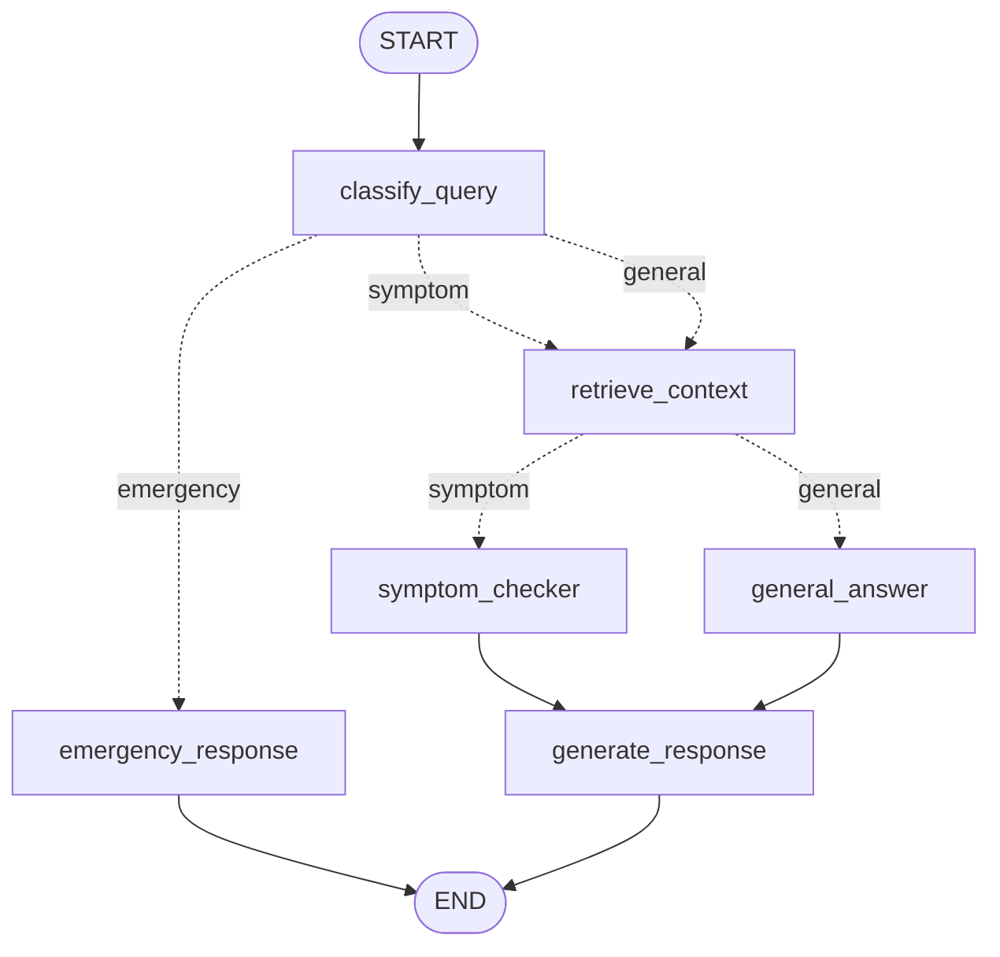

# 🩺 MedAssist

An agentic AI patient Q&A assistant built with **LangGraph** multi-agent orchestration, **FastMCP** structured tools, and a **Streamlit** chat frontend. MedAssist triages every message, routes it through the right specialist path, grounds answers with live web search, and persists every conversation to SQLite.

> ⚠️ **Disclaimer:** MedAssist provides health *information* only. It is not a medical device, does not diagnose or prescribe, and is no substitute for professional medical advice. In an emergency, call your local emergency number.

## ✨ Features

- **LLM triage** — every message is classified as `symptom`, `general`, or `emergency` using structured output (Pydantic) on Groq's Llama 3.3 70B
- **Emergency short-circuit** — red-flag messages skip everything and immediately return an urgent-care warning
- **Symptom analysis** — extracted symptoms are checked against a red-flag table and the patient's BMI via MCP tools before the LLM drafts a cautious assessment
- **Web-grounded general answers** — general health questions trigger a DuckDuckGo search; answers cite their source URLs
- **RAG knowledge base** — upload medical reference PDFs (guidelines, leaflets, formularies) from the sidebar; a `retrieve_context` node grounds both symptom assessments and general answers in the most relevant passages, cited by document and page (Chroma vector store + local Ollama embeddings)
- **Patient profiles** — age, sex, weight, height, allergies, and conditions are attached to every conversation
- **Streaming answers** — assistant responses render token-by-token as the LLM generates them
- **Persistent conversations** — a SQLite checkpointer saves every thread; the app opens on a fresh conversation, and past chats can be reopened from the sidebar
- **Full observability** — LangSmith tracing covers every node, LLM call, and MCP tool call, grouped into conversations by thread

## 🏗️ Architecture



| Node | Role |
|---|---|
| `classify_query` | LLM triage with structured output → sets `query_type`, extracts `symptoms` + `symptom_duration` |
| `emergency_response` | Hardcoded urgent-care message, no LLM — fast and fail-safe |
| `retrieve_context` | RAG retrieval: pulls the top knowledge-base passages relevant to the message (skipped for emergencies) |
| `symptom_checker` | Calls `check_symptom_red_flags` + `calculate_bmi` MCP tools, then drafts a cautious assessment grounded in retrieved passages |
| `general_answer` | Calls the `web_search` MCP tool (DuckDuckGo), answers citing knowledge-base documents and source URLs |
| `generate_response` | Appends the final response to the conversation history |

### RAG pipeline (`rag.py`)

Uploaded PDFs are split into 1000-character chunks (150 overlap) with `RecursiveCharacterTextSplitter`, embedded locally with Ollama (`nomic-embed-text` by default, configurable via `EMBEDDING_MODEL`), and stored in a persistent Chroma collection (`medassist_kb/`, cosine similarity). At query time the top 4 passages above a relevance threshold are injected into the prompt; re-uploading a file replaces its old chunks. If Ollama is down or nothing relevant is found, the graph degrades gracefully and answers without document grounding.

### MCP tools (`mcp_server.py`)

The FastMCP server `MedAssist-Tools` exposes five tools, called in-process by the graph and also runnable as a standalone MCP server:

| Tool | Purpose |
|---|---|
| `calculate_bmi` | BMI + WHO category from weight/height |
| `check_symptom_red_flags` | Matches symptoms against an emergency red-flag table |
| `medication_info` | Local OTC formulary lookup (generic + brand names) |
| `check_allergy_conflict` | Flags medication ↔ allergy conflicts, incl. cross-reactions |
| `web_search` | Live DuckDuckGo search (title, URL, snippet) |

## 🛠️ Tech stack

| Layer | Technology |
|---|---|
| Orchestration | LangGraph (`StateGraph`, conditional edges, SQLite checkpointer) |
| LLM | Groq — Llama 3.3 70B via `langchain-groq` |
| Tools | FastMCP server + in-process MCP client |
| Web search | DuckDuckGo (`ddgs`) |
| RAG | Chroma vector store (`langchain-chroma`) + Ollama embeddings (`nomic-embed-text`) + PyPDF loader |
| Frontend | Streamlit chat UI |
| Persistence | SQLite (`langgraph-checkpoint-sqlite`) |
| Observability | LangSmith tracing |

## 🚀 Getting started

### Prerequisites

- Python ≥ 3.13
- [uv](https://docs.astral.sh/uv/) package manager
- A [Groq API key](https://console.groq.com/) (free tier available)
- [Ollama](https://ollama.com/) running locally with the embedding model pulled: `ollama pull nomic-embed-text` (needed for the RAG knowledge base)
- Optional: a [LangSmith API key](https://smith.langchain.com/) for tracing

### Setup

```bash
git clone <your-repo-url>
cd ProjectMedAssist
uv sync
```

Create a `.env` file in the project root:

```env
GROQ_API_KEY="your-groq-key"

# Optional — Ollama embedding model for RAG (default: nomic-embed-text)
EMBEDDING_MODEL="nomic-embed-text"

# Optional — LangSmith tracing
LANGCHAIN_API_KEY="your-langsmith-key"
LANGSMITH_TRACING="true"
LANGSMITH_PROJECT="MedAssist"
```

### Run the app

```bash
uv run streamlit run frontend.py
```

> Always launch through `uv run` so the project's virtual environment is used.

### Run the MCP server standalone (optional)

The graph calls the tools in-process, so this is only needed to expose the tools to external MCP clients (e.g. Claude Desktop):

```bash
uv run python mcp_server.py                                        # stdio
uv run fastmcp run mcp_server.py:mcp --transport http --port 8001  # HTTP
```

## 📁 Project structure

```
ProjectMedAssist/
├── BackEnd.py                  # State, nodes, graph wiring, checkpointer, thread helpers
├── rag.py                      # RAG pipeline: PDF ingestion, Chroma store, retrieval
├── mcp_server.py               # FastMCP server with the five medical tools
├── frontend.py                 # Streamlit chat UI (profile, knowledge base, threads)
├── pyproject.toml              # Dependencies (managed by uv)
├── .env                        # API keys (never committed)
├── documents/                  # Uploaded knowledge-base PDFs (never committed)
├── medassist_kb/               # Chroma vector store (never committed)
└── medassist_checkpoints.db    # Conversation history (never committed)
```

## 💬 Usage

1. Fill in the **patient profile** in the sidebar (all fields optional)
2. Optionally upload reference PDFs under **📚 Knowledge base** and click **Index documents** — subsequent answers cite them by document and page
3. Ask a question — try:
   - *"I've had a mild headache since this morning"* → symptom path with tool results
   - *"What is the difference between paracetamol and ibuprofen?"* → web-grounded answer with citations
   - *"I have crushing chest pain"* → emergency banner
4. Expand **🔧 MCP tool results** under an answer to see the raw tool outputs and retrieved knowledge-base passages
5. Click **➕ New chat** for a fresh conversation (resets the profile), or reopen any previous chat from the sidebar — history persists across restarts, and every new app launch starts on a clean conversation

## 📄 License

MIT
